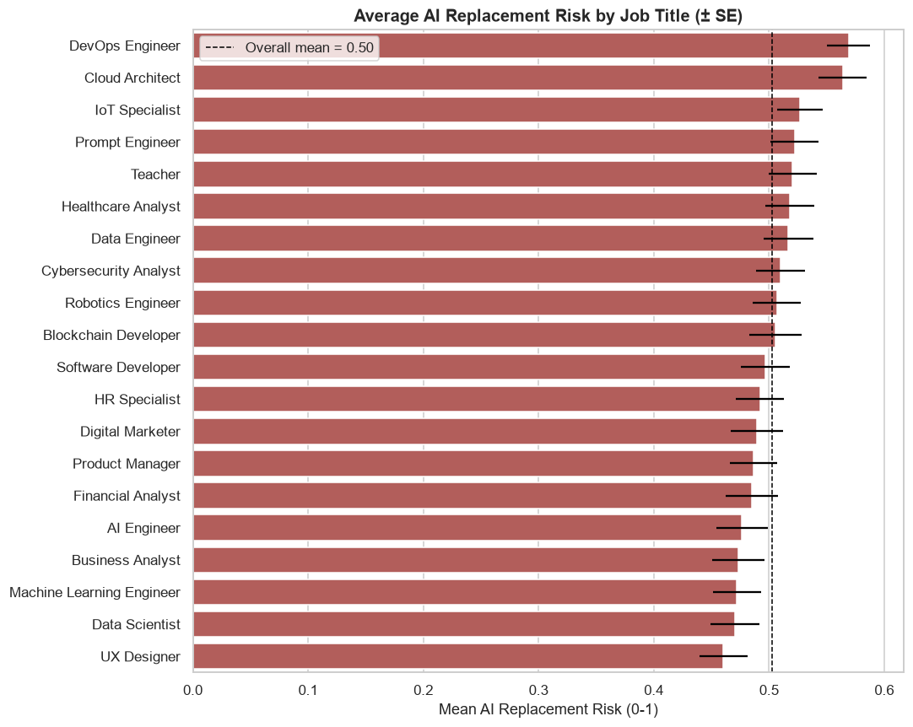
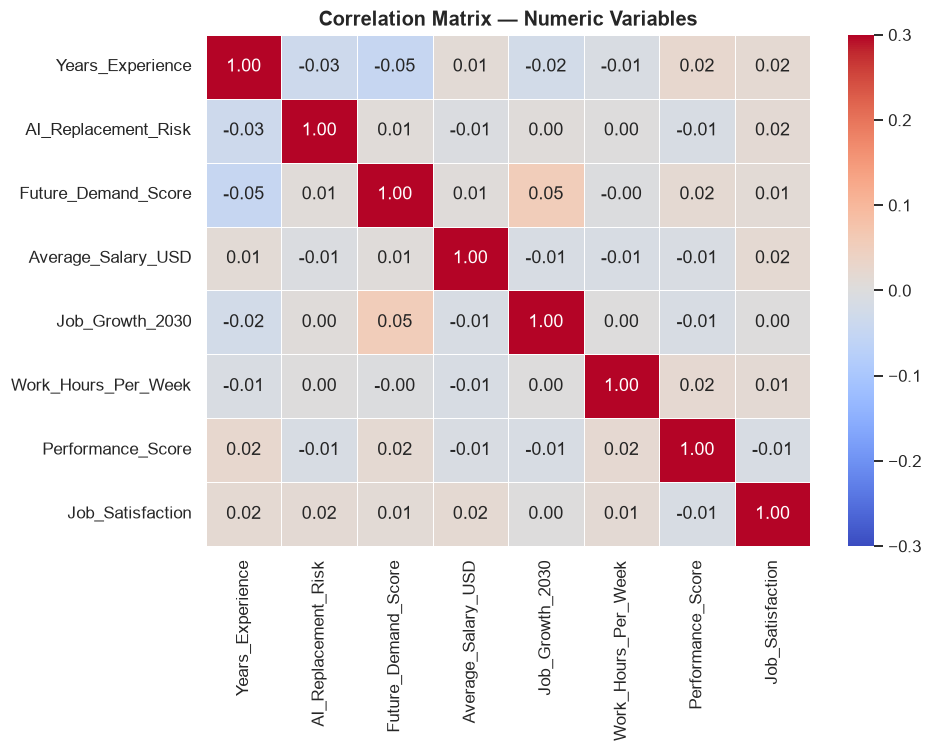
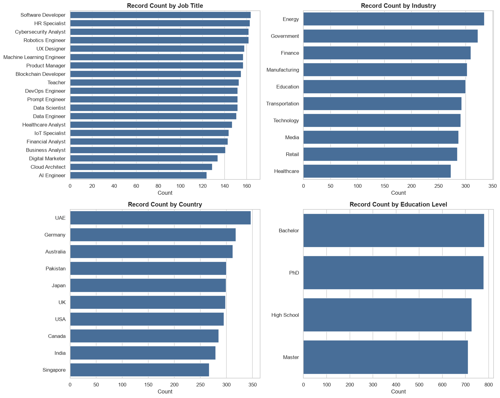

# AI's Impact on Jobs by 2030 — EDA & Statistical Validation

Exploratory data analysis of a 3,000-record dataset covering job titles, industries,
countries, AI replacement risk, future demand, salary, and work-arrangement trends —
plus formal hypothesis testing to check whether the patterns that show up in the charts
are statistically real or just noise.

**[Open the full notebook →](notebooks/analysis.ipynb)** · **[Interactive dashboard (live) →](https://hashtro9-rgb.github.io/Ai-Jobs-2030-Analysis/dashboard/)**

## Why this project is different

Most quick looks at a dataset like this stop at "here's a bar chart, industry X has
higher risk than industry Y." This project goes one step further: every visual pattern
gets run through an actual significance test (ANOVA, chi-square, Pearson correlation,
effect sizes) before it's allowed into the conclusions. That distinction — a pattern
looking real vs. being statistically real — is the core skill this project demonstrates.

## Key finding

**None of the "obvious" relationships in this dataset are statistically significant.**

| Test | Statistic | p-value | Significant? |
|---|---|---|---|
| AI Risk ~ Industry (ANOVA) | F = 1.37 | 0.196 | No |
| AI Risk ~ Job Title (ANOVA) | — | > 0.05 | No |
| Salary ~ Education Level (ANOVA) | F = 0.87 | 0.458 | No |
| Hiring Trend ~ Industry (chi-square) | χ² = 25.6, dof = 18 | 0.109 | No |
| AI Risk vs. Salary (Pearson r) | r = -0.007 | 0.713 | No |
| Years Experience vs. AI Risk (Pearson r) | r = -0.034 | 0.065 | No |

Combined with near-perfectly uniform category counts (every job title, industry, and
country is represented almost equally) and clean, non-skewed distributions across every
numeric field, the evidence points to a **synthetically generated dataset with
independently randomized fields** rather than a sample of real labor-market outcomes.
That's a useful, honest conclusion in its own right — it's the difference between mining
a dataset for a story vs. reporting what's actually in it.

## What's in the data

- 3,000 rows, 20 columns, zero missing values
- 20 job titles (Data Scientist, DevOps Engineer, Teacher, AI Engineer, ...)
- 10 industries, 10 countries, 4 education levels
- Fields: AI replacement risk, future demand score, salary, automation level, remote-work
  possibility, required skills, job growth projection, hiring trend, and more

## Selected charts

**Average AI replacement risk by job title** — DevOps Engineer and Cloud Architect rank
highest, but note the error bars overlap the overall mean for nearly every role:



**Correlation structure** — every pairwise correlation among the numeric fields is under
|0.05|, meaning none of them move together in any meaningful way:



**Categorical landscape** — job titles, industries, countries, and education levels are
all close to evenly represented, which is itself a signal the data was randomly generated:



More charts (salary landscape, skill demand, hiring trends by industry, work-arrangement
mix) are in the [notebook](notebooks/analysis.ipynb) and the [`charts/`](charts/) folder.

## Repo structure

```
.
├── data/
│   └── AI_Impact_on_Jobs_2030.csv     # source dataset (3,000 rows)
├── notebooks/
│   ├── analysis.ipynb                 # main analysis, executed with outputs
│   └── build_notebook.py              # script that generates analysis.ipynb from scratch
├── dashboard/
│   ├── index.html                     # self-contained interactive dashboard (Chart.js)
│   └── data.js                        # pre-processed data + skill aggregates
├── charts/                            # all figures exported as standalone PNGs
├── requirements.txt
└── README.md
```

## Interactive dashboard

[`dashboard/index.html`](dashboard/index.html) is a self-contained page (Chart.js via CDN,
data embedded in `data.js`) with stat cards, filters by industry / country / education, and
live-updating charts for risk by job title, risk by industry, salary by country, hiring and
remote-work mix, a risk-vs-demand bubble chart, and top skills.

**Host it free on GitHub Pages:** push this repo, then in the repo's
*Settings → Pages* set the source to the `main` branch (root). The dashboard will be live at
`https://<your-username>.github.io/<repo-name>/dashboard/`. To preview locally instead:

```bash
python -m http.server 8000 --directory dashboard
# then open http://localhost:8000
```

## Reproducing this analysis

```bash
pip install -r requirements.txt
jupyter nbconvert --to notebook --execute --inplace notebooks/analysis.ipynb
```

Or open `notebooks/analysis.ipynb` directly in Jupyter/VS Code to step through it
interactively.

## Tools

Python, pandas, matplotlib, seaborn, scipy (hypothesis testing), Jupyter.

## Caveat

This dataset's origin/collection methodology is not documented, and the statistical
tests above indicate it does not reflect a real labor market sample. Treat any
descriptive pattern here (e.g. "DevOps roles show the highest average risk score") as an
artifact of this specific simulated dataset, not a real-world claim about AI's impact on
employment.

